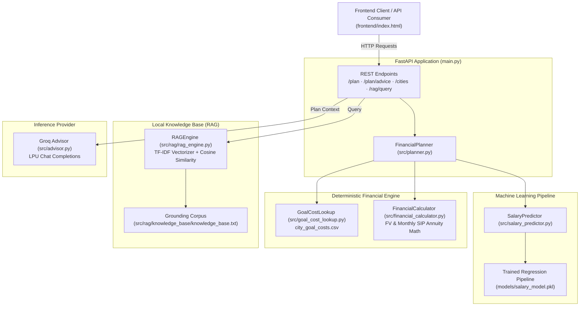

# AI Financial Dream & Goal Planner

[](https://www.python.org/)
[](https://fastapi.tiangolo.com)
[](https://scikit-learn.org/)
[](https://pytest.org)
[](https://github.com/astral-sh/ruff)
[](https://mypy-lang.org/)

An enterprise-ready, end-to-end personal finance forecasting platform tailored for early-career professionals and freshers. The platform predicts expected monthly compensation via machine learning regression, projects future milestone costs (Marriage, Car, Home) adjusted for inflation across Indian metropolitan tiers, calculates required systematic investment plans (SIP), delivers contextual AI financial commentary via Groq, and runs an offline, zero-hallucination local RAG knowledge base.

---

## Architecture Overview



---

## Core Capabilities

1. **Machine Learning Salary Estimation**
   - Estimates fresher monthly earnings using categorical and numeric demographic features: `Age`, `City`, `Education`, and `Job_Role`.
   - Trained on structured market compensation data (`data/salary_data.csv`).
   - Uses `OneHotEncoder(handle_unknown="ignore")` inside a scikit-learn `Pipeline` to ensure unseen categories never cause runtime exceptions.
   - Strictly enforces the **Fresher Rule**: Experience is excluded from input features to prevent bias and data leakage.

2. **Deterministic Financial Planning Math**
   - **Inflation Adjustment**: Calculates compound future cost of goals across arbitrary year horizons:
     $$\text{Future Cost} = \text{Base Cost} \times (1 + r_{\text{inflation}})^n$$
   - **Required Monthly SIP**: Calculates the exact monthly annuity needed to hit the target future value:
     $$\text{SIP} = \text{Future Cost} \times \frac{i}{(1 + i) \times ((1 + i)^m - 1)}$$
     where $i = \frac{r_{\text{return}}}{12}$ and $m = n \times 12$.
   - **Feasibility Categorization**: Automatically categorizes goals based on the ratio of required SIP to available monthly savings capacity:
     - **Achievable**: $\le 100\%$ of capacity
     - **Challenging**: $> 100\%$ and $\le 125\%$ of capacity
     - **Highly Challenging**: $> 125\%$ of capacity
   - **Investment Horizon Guidance**: Automatic category recommendations (**Short-Term**, **Medium-Term**, **Long-Term**) based on investment horizon.

3. **Contextual AI Financial Advisor**
   - Communicates with Groq's high-speed inference API to generate personalized, plain-language recommendations based on deterministic numbers computed by the engine.
   - Resilient design: Gracefully falls back to deterministic heuristic advice when `GROQ_API_KEY` is not configured or external APIs are unreachable.

4. **Local Zero-Hallucination RAG Engine**
   - Offline text retrieval using scikit-learn TF-IDF vectorization and cosine similarity over financial planning documents.
   - Enforces strict similarity thresholds and multi-term overlap checks.
   - Explicitly returns a refusal message whenever questions fall outside the knowledge corpus rather than generating ungrounded answers.

5. **Self-Contained Frontend**
   - Interactive, single-page web interface (`frontend/index.html`) featuring an investment ledger, dynamic feasibility badges, live API status indicators, and financial knowledge Q&A.

---

## Project Structure

```text
financial_planner/
├── .env.example              # Environment variable template
├── .gitignore                # Git ignore patterns (virtualenvs, caches, models)
├── README.md                 # Project documentation and specifications
├── requirements.txt          # Python runtime dependencies
├── main.py                   # FastAPI REST API application & route definitions
│
├── data/                     # Source datasets
│   ├── city_goal_costs.csv   # Real-estate, automobile & marriage costs across Indian cities
│   └── salary_data.csv       # Fresher compensation dataset for model training
│
├── frontend/                 # Client UI
│   └── index.html            # Standalone, zero-build responsive web interface
│
├── models/                   # Serialized ML artifacts
│   └── salary_model.pkl      # Trained scikit-learn regression pipeline
│
├── src/                      # Core application modules
│   ├── schemas.py            # Pydantic validation schemas (PlanRequest, PlanResponse)
│   ├── planner.py            # Orchestrator binding ML, lookup, and financial math
│   ├── salary_predictor.py   # Model loader and inference wrapper
│   ├── goal_cost_lookup.py   # Baseline city-wise cost aggregation
│   ├── financial_calculator.py # Future value, required SIP, and feasibility math
│   ├── advisor.py            # Groq LLM integration with heuristic fallback
│   ├── groq_agent.py         # Intent parsing and tool execution agent
│   ├── agent_tools.py        # Tool registry definitions
│   └── rag/                  # Local retrieval system
│       ├── rag_engine.py     # TF-IDF cosine-similarity retrieval engine
│       └── knowledge_base/   # Grounding texts and financial planning guidelines
│           └── knowledge_base.txt
│
└── tests/                    # Automated test suite
    └── test_cases.py         # 18 end-to-end and unit test cases
```

---

## Quickstart

### 1. Environment Setup

```bash
# Clone repository
git clone https://github.com/Gourab30/Financial-Dream-Planner.git
cd Financial-Dream-Planner

# Create and activate virtual environment
python -m venv venv
# On Windows:
.\venv\Scripts\activate
# On Linux/macOS:
source venv/bin/activate

# Install dependencies
pip install -r requirements.txt
```

### 2. Configure Environment

Copy `.env.example` to `.env` and configure your API keys:

```bash
cp .env.example .env
```

```ini
GROQ_API_KEY=your_groq_api_key_here
GROQ_MODEL=openai/gpt-oss-120b
```

*(Note: If `GROQ_API_KEY` is omitted, the application automatically uses heuristic fallback advice without breaking).*

### 3. Launch Application

```bash
# Start FastAPI backend
python -m uvicorn main:app --reload --host 127.0.0.1 --port 8000
```

Open `frontend/index.html` in your web browser. The frontend connects to `http://127.0.0.1:8000` automatically.

---

## API Reference

Interactive Swagger documentation is available at `http://127.0.0.1:8000/docs`.

| Method | Endpoint | Description | Auth |
| :--- | :--- | :--- | :--- |
| `GET` | `/` | API health check and status confirmation | Public |
| `GET` | `/cities` | Returns list of supported Indian metropolitan cities | Public |
| `POST` | `/plan` | Computes salary, SIP requirements, and milestone feasibility | Public |
| `POST` | `/plan/advice` | Computes full plan enriched with AI advisor commentary | Public |
| `POST` | `/rag/query` | Grounded local knowledge base search and answer retrieval | Public |

### Sample Plan Request (`POST /plan`)

```json
{
  "name": "Rahul",
  "age": 22,
  "city": "Bangalore",
  "education": "B.Tech",
  "job_role": "Software Engineer",
  "savings_percent": 20.0,
  "expected_investment_return": 0.09,
  "marriage_years": 5,
  "car_years": 4,
  "home_years": 10
}
```

### Sample Plan Response (`POST /plan`)

```json
{
  "name": "Rahul",
  "predicted_monthly_salary": 48250.0,
  "available_monthly_capacity": 9650.0,
  "goals": [
    {
      "goal_type": "Marriage",
      "years": 5,
      "base_cost_today": 835000.0,
      "future_cost": 1117418.36,
      "required_monthly_sip": 14934.33,
      "recommended_category": "Medium-Term (Hybrid / Balanced Advantage Funds)",
      "status": "Challenging"
    },
    {
      "goal_type": "New Car",
      "years": 4,
      "base_cost_today": 1179000.0,
      "future_cost": 1488460.34,
      "required_monthly_sip": 26038.52,
      "recommended_category": "Short-Term (Debt Funds / Conservative Hybrid / Liquid)",
      "status": "Highly Challenging"
    },
    {
      "goal_type": "New Home",
      "years": 10,
      "base_cost_today": 8840000.0,
      "future_cost": 15830971.05,
      "required_monthly_sip": 81050.29,
      "recommended_category": "Long-Term (Equity Mutual Funds / Index Funds)",
      "status": "Highly Challenging"
    }
  ],
  "total_required_monthly_sip": 122023.14,
  "overall_shortfall_or_surplus": -112373.14,
  "overall_status": "Highly Challenging",
  "assumptions": {
    "annual_inflation": 0.06,
    "expected_investment_return": 0.09,
    "savings_percent": 20.0,
    "max_sip_ratio_warning": 0.40,
    "note": "Educational simulation only. Not professional financial advice. Returns are not guaranteed."
  }
}
```

---

## Verification & Testing

The test suite covers end-to-end plan generation, single-goal plans, categorical handling, mathematical boundaries (zero/negative years, percentage limits), shortfall detection, RAG grounding, hallucination resistance, prompt injection security, and city dataset integrity.

Execute tests with coverage:

```bash
pytest tests/test_cases.py -v --cov=src --cov-report=term-missing
```

### Verified Test Results

```text
============================= test session starts =============================
platform win32 -- Python 3.14.2, pytest-9.1.1, pluggy-1.6.0
collected 18 items

tests/test_cases.py::test_01_valid_end_to_end_plan PASSED                [  5%]
tests/test_cases.py::test_02_single_goal_plan PASSED                     [ 11%]
tests/test_cases.py::test_03_unknown_city_raises PASSED                  [ 16%]
tests/test_cases.py::test_04_unknown_education_job_role_handled_gracefully PASSED [ 22%]
tests/test_cases.py::test_05_zero_years_raises PASSED                    [ 27%]
tests/test_cases.py::test_06_negative_years_raises PASSED                [ 33%]
tests/test_cases.py::test_07_savings_percent_below_zero PASSED           [ 38%]
tests/test_cases.py::test_08_savings_percent_above_hundred PASSED        [ 44%]
tests/test_cases.py::test_09_no_goal_selected_raises PASSED              [ 50%]
tests/test_cases.py::test_10_boundary_one_year_goal PASSED               [ 55%]
tests/test_cases.py::test_11_shortfall_detected_when_required_exceeds_capacity PASSED [ 61%]
tests/test_cases.py::test_12_feasibility_classification_boundaries PASSED [ 66%]
tests/test_cases.py::test_13_investment_category_rule PASSED             [ 72%]
tests/test_cases.py::test_14_rag_grounded_answer PASSED                  [ 77%]
tests/test_cases.py::test_15_rag_refuses_out_of_scope_question PASSED    [ 83%]
tests/test_cases.py::test_16_prompt_injection_does_not_leak_or_bypass PASSED [ 88%]
tests/test_cases.py::test_17_natural_language_end_to_end_matches_direct_call PASSED [ 94%]
tests/test_cases.py::test_18_city_list_available PASSED                  [100%]

======================= 18 passed in 5.87s =======================
```

---

## Engineering Assumptions & Limitations

- **Audience Scope**: Specifically optimized for freshers and early-career individuals in India. Prior experience is deliberately excluded from feature engineering.
- **Inflation Modelling**: Future goal projections use a standard compound annual rate of $6.0\%$ per annum based on historical Indian CPI metrics.
- **City Aggregation**: Metropolitan goal baselines in `data/city_goal_costs.csv` represent the mean across documented urban tiers and sub-localities.
- **RAG Similarity Floor**: The local retrieval engine enforces a minimum cosine similarity threshold of $0.12$ and $\ge 2$ shared token terms to strictly eliminate hallucinated answers on out-of-domain financial queries.
- **Educational Disclaimer**: All computations represent financial projections for educational simulation purposes and should not be construed as SEBI-registered investment advisory.

---

## License

This project is licensed under the MIT License.
